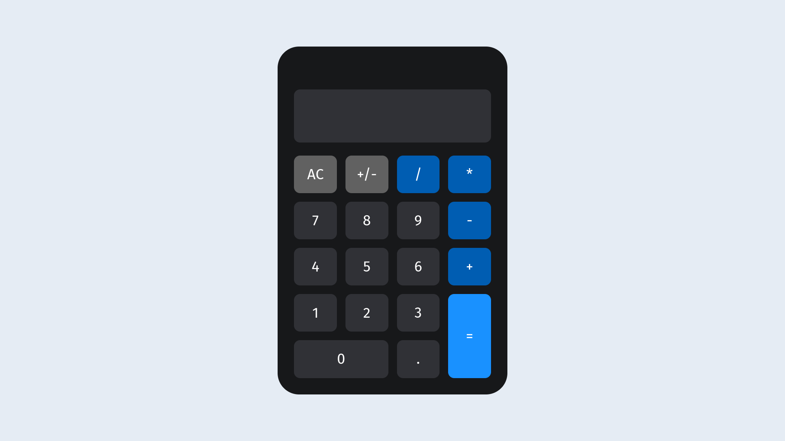

# Calculadora (HTML + CSS + JavaScript)

Uma calculadora funcional desenvolvida com HTML, CSS e JavaScript.  
Este projeto foi feito como um exercício prático para treinar a construção de layouts com **CSS Grid** e a lógica interativa com **JavaScript**.

[🔗 Acesse o site do projeto](https://rhuan-ribeiro.github.io/Calculator/)

---

## 🔧 Tecnologias utilizadas

- HTML5  
- CSS3 (com foco em **CSS Grid**)  
- JavaScript (lógica de operações e interações)

---

## 💡 Aprendizados

- Criação de interfaces organizadas com **CSS Grid**
- Manipulação de eventos no DOM com JavaScript
- Implementação da lógica de uma calculadora básica
- Suporte a entrada via **clique nos botões** ou **digitação no teclado**

---

## 📸 Captura de tela

---

## 🚀 Acesse o projeto

👉 [Clique aqui para acessar a calculadora online](https://rhuan-ribeiro.github.io/Calculator/)

## 🙏 Créditos

Este projeto foi desenvolvido seguindo um exercício proposto por **Rodolfo Mori** em seu canal no YouTube, [DevClub | Programação](https://www.youtube.com/@canaldevclub).  
Fazia parte de uma aula sobre **CSS Grid** e me ajudou a dominar o conceito na prática.
